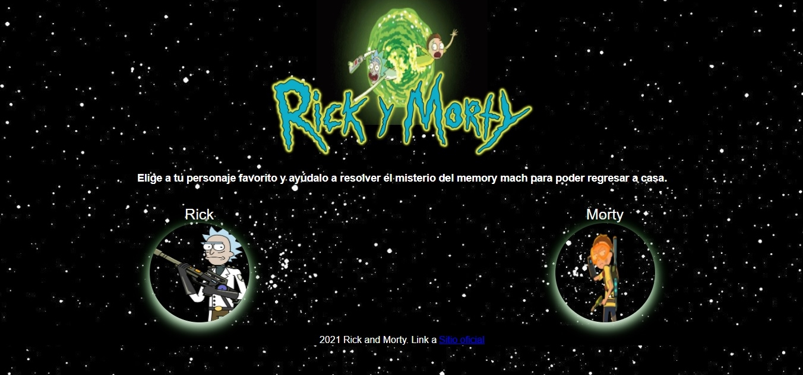
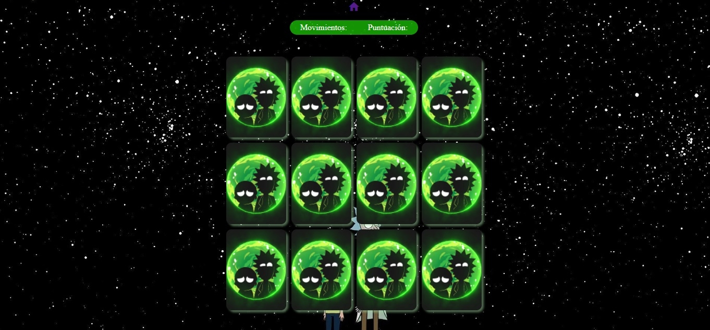
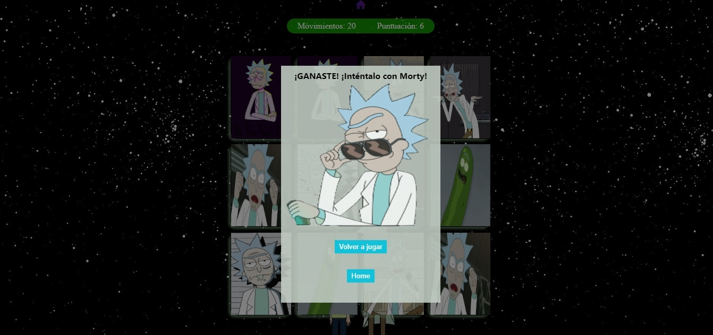
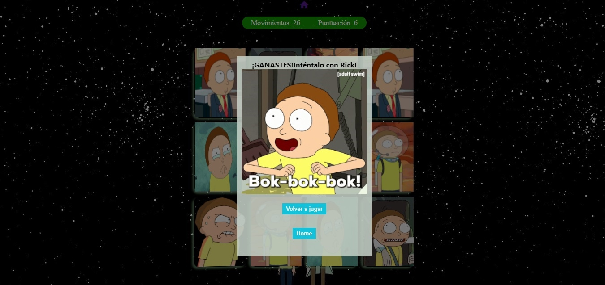

## Memory Macth Rick y Morty

* Link proyecto: [Ir al Sitio](https://danielaalcaladaboin.github.io/SCL019-memory-match/src/index.html)

## Índice
* [1. Preámbulo](#1-preámbulo)
* [2. Etapas del proceso UX.](#2-etapas-del-proceso-ux)
* [3. Prototipo de alta fidelidad](#3-prototipo-de-alta-fidelidad)
* [4. Historia de usuario](#4-historia-de-usuario)
* [5. Definición de terminado](#5-definición-de-terminado)
* [6. Imágenes del proyecto terminado](#6-imágenes-del-proyecto-terminado)

## 1. Preámbulo

Nuestro proyecto es un Memory Match con la temática de la serie Rick y Morty, con el fin de que el usuario se divierta y entretenga. Nuestros usuarios objetivos son los fánaticos de la serie, ya que se hacen varias referencias que encontrarán interesantes, aunque no se limita solo a ellos, cualquier persona puede usarla. 

## 2. Etapas del proceso UX

1- Descubrimiento e investigación: Realizamos un análisis sobre la necesidad del usuario, concluyendo que es la entretención en su tiempo libre, algo divertido para relajarse y pasarla bien. Nos inspiramos en varios memory match encontrados en la web (Observación e investigación contextual).

2- Síntesis y definición: Después de un análisis sobre los juegos de tipo memory match y nuestra temática, identificamos que la serie es para mayores de 16 años, ya que contiene lenguaje mal sonante, referencias sexuales y violencia. Nosotras decidimos que no ocupariamos ninguna referencia de estos tipos, ya que deseabamos que nuestra web fuera para todo tipo de usuario. 

Definimos nuestro producto como juego memory match con temática de Rick y Morty, para la entretención en el tiempo libre de nuestros usuarios.

3- Ideación: En esta estapa hicimos un brain storming de los elementos que deseabamos que tuviera nuestra web y su funcionamiento. Algunas de nuestras ideas fueron:
       * Página de bienvenida
       * Opción de seleccionar personaje favorito
       * Opciones de fácil, intermedio y dificil
       * Contador de puntuación y cronómetro
       * Botón de reiniciar y home
       * Agregarle música
       * Agregarle animación

4- Prototipado:Realizamos un prototipo primeramente de baja fidelidad, utilizando la opción de pizarra del zoom para poder ir creandolo juntas, en este fuimos plasmando como queriamos que fuera nuestra página. Lo testeamos con nuestra familia e identificamos que comprendian a gran escala la idea y el funcionamiento. Nos aconsejaron tener especial cuidado con la jerarquía de los elementos y la convinación de fondo negro con letras blancas.
link de prototipos de baja fidelidad: carpeta Prototipo Papel

## 3. Prototipo de alta fidelidad

Posteriormente creamos nuestro prototipo en Figma (link figma: https://www.figma.com/file/WleMCXvozMLmdBv4RQcled/Rick-and-Morty-Memory-match?node-id=0%3A1), y pedimos el feedback de nuestras compañeras. Nos recomendaron que identificaramos más claramente el papel de los botones de los personajes como opciones, poniendoles el nombre de cada uno sobre la imagen. Crear un menu para que fuera más interactiva y tener un botón para mostrar resultados. Con estas sugerencias, procedimos a crear nuestra página web perfeccionando su diseño.

 Simultáneamente al análisis de nuestros usuarios, procedimos a realizar nuestras historias de usuarios. Una vez efectuada nuestra investigación con varias personas, a las cuales nos referiremos como Pedro Perez.

## 4. Historia de Usuario

 Pedro Pérez tiene rol de usuario, su objetivo es jugar un memory match de la temática de Rick y Morty, su motivación es divertirse y entretenerse en su tiempo libre con un juego con temática de una serie que le gusta.

 Como Pedro Pérez quiero jugar el memory match de Rick and Morty para divertirme en mi tiempo libre. 

Como criterio de aceptación identificamos:

* El usuario debe elegir su personaje favorito, en caso contrario no continua el juego
* El usuario debe elegir el nivel de dificultad, en caso contrario no prosigue el juego(no      desarollamos esta)
* El usuario debe elegir las cartas en pares e intentar que coincidan, en caso contrario, debera seguir intentandolo hasta lograrlo y el marcador de movimientos ira en aumento.
* El usuario debe elegir las cartas correctas, ganando el juego, visualizando su puntuación y mensaje de felicitación.

Como definición de terminado nos planteamos:
* Tener una página de bienvenida
* Tener la opción de elegir entre Rick y Morty
* Tener una data de Rick y una de Morty
* Tener contador de movimiento y puntuación
* Tener popup con mensaje de felicitaciones
* Tener un boton de reiniciar y otro para retornar al home

## 5. Definición de terminado

Consideramos que cumplimos con nuestra definicion de terminado.

Una vez terminada nuestra página, la testeamos con muchas personas, incluidas nuestras compañeras de bootcamp, familiares y amigos. Nos indicaron que entendieron la dinámica de la página y que disfrutaron el juego, por lo que creemos que cumplimos nuestros objetivos.

Somos consciente que puede perfeccionarse mucho más, por lo que seguiremos estudiando y aprendiendo para poder hacer un mejor trabajo en el futuro.

Respecto a nuestras pruebas unitarias, consideramos que no las enfrentamos de una forma eficiente, ya que primero nos enfocamos en que nuestra página funcionara y no fuimos testeando función por función. Una vez terminado todo, comenzamos a pasar los test y estos no tenían el coverage esperado, por lo que comenzamos a realizar modificaciones para intentar que pasara. En esta ocasión, fuimos a pedir ayuda a nuestros coaches para no repetir errores pasados, y nos hicieron reflexionar si valía la pena para nosotras refactorizar todo nuestro código para poder testearlo. Llegamos a la conclusión que debiamos seguir avanzando y desarrollando este objetivo de aprendizaje en nuestro próximo proyecto, junto al perfeccionamiento de las historias de usuarios.

## 6. Imágenes del proyecto terminado

